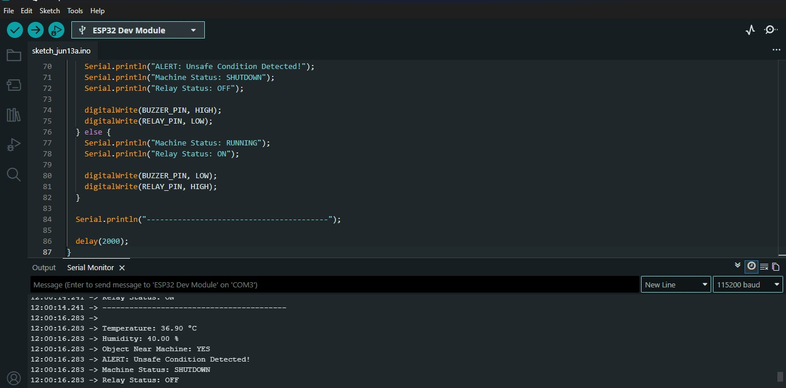

# ESP32 Smart Machine Health Monitor

An ESP32-based machine safety monitoring prototype that detects unsafe operating conditions using temperature, humidity, and proximity sensing. When an unsafe condition is detected, the system activates a buzzer and switches a relay to simulate an emergency machine shutdown.

## Overview

The system continuously monitors:

- **Temperature and humidity** using a DHT11 sensor
- **Objects or persons near the machine area** using an IR obstacle sensor
- **Unsafe conditions** using configurable safety logic

If either a nearby object is detected or the temperature reaches the configured limit, the ESP32:

1. Activates the buzzer
2. Turns the relay OFF
3. Reports the machine status as `SHUTDOWN` in the Serial Monitor

During normal operation, the buzzer remains OFF, the relay remains ON, and the machine status is reported as `RUNNING`.

## Features

- Real-time temperature monitoring
- Real-time humidity monitoring
- IR-based object/person detection
- Configurable high-temperature limit
- Buzzer alert for unsafe conditions
- Relay-based emergency shutdown simulation
- Live Serial Monitor status output
- ESP32-based embedded firmware
- Practical breadboard hardware prototype

## Hardware Used

- ESP32 Development Board
- DHT11 Temperature and Humidity Sensor
- IR Obstacle Detection Sensor
- Active Buzzer
- Relay Module
- Breadboard
- Jumper Wires

## Software Requirements

- Arduino IDE
- ESP32 Arduino Core
- DHT Sensor Library by Adafruit
- Adafruit Unified Sensor Library

## Pin Connections

### DHT11 Sensor

| DHT11 Pin | ESP32 Connection |
|---|---|
| VCC | 3.3V |
| GND | GND |
| DATA | GPIO 4 |

### IR Obstacle Sensor

| IR Sensor Pin | ESP32 Connection |
|---|---|
| VCC | 3.3V |
| GND | GND |
| OUT | GPIO 15 |

### Buzzer

| Buzzer Pin | ESP32 Connection |
|---|---|
| Positive | GPIO 25 |
| Negative | GND |

### Relay Module

| Relay Pin | ESP32 Connection |
|---|---|
| VCC | VIN / 5V |
| GND | GND |
| IN | GPIO 26 |

## Safety Logic

The firmware uses the following logic:

```text
IF object detected near machine
   OR
   temperature >= 38.0°C

THEN
   Buzzer = ON
   Relay = OFF
   Machine Status = SHUTDOWN

ELSE
   Buzzer = OFF
   Relay = ON
   Machine Status = RUNNING
```

The temperature limit is defined in the source code as:

```cpp
#define TEMP_LIMIT 38.0
```

## Project Flow

```text
DHT11 + IR Sensor
        ↓
      ESP32
        ↓
  Safety Decision
        ↓
 ┌──────┴──────┐
 │             │
Safe        Unsafe
 │             │
Relay ON     Relay OFF
Buzzer OFF   Buzzer ON
RUNNING      SHUTDOWN
```

## Serial Monitor Output

Example unsafe-condition output:

```text
Temperature: 36.90 °C
Humidity: 40.00 %
Object Near Machine: YES
ALERT: Unsafe Condition Detected!
Machine Status: SHUTDOWN
Relay Status: OFF
```

## Demo

### Hardware Setup


### Serial Monitor Alert Output



## Project Structure

```text
ESP32-Smart-Machine-Health-Monitor/
├── README.md
├── machine_safety_monitor.ino
├── circuit_photo.jpg
└── serial_output_alert.jpg
```

## How to Run

1. Install the Arduino IDE.
2. Add ESP32 board support through the ESP32 Arduino Core.
3. Install the **DHT Sensor Library by Adafruit**.
4. Install the **Adafruit Unified Sensor Library**.
5. Open `machine_safety_monitor.ino`.
6. Select the correct ESP32 board and serial port.
7. Upload the firmware.
8. Open the Serial Monitor at **115200 baud**.

## Project Status

The practical hardware prototype is implemented with ESP32, DHT11, IR sensor, buzzer, and relay-based shutdown simulation.

## Future Improvements

- Add MPU6050 vibration monitoring
- Add cloud or IoT dashboard integration
- Store sensor data for historical analysis
- Add SMS or mobile alert notifications
- Introduce additional machine health parameters
